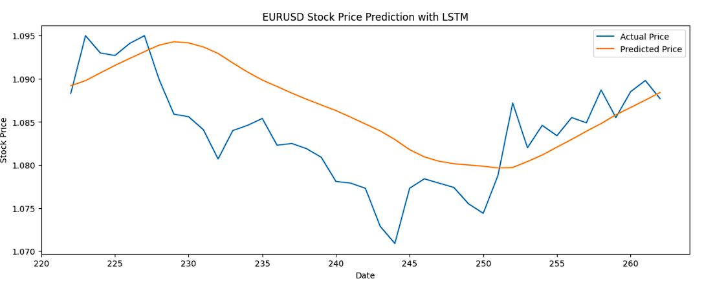

# 💹 Prediksi EUR/USD Menggunakan Long Short-Term Memory (LSTM)

## 📌 Deskripsi Proyek

Proyek ini bertujuan untuk melakukan prediksi harga pasangan mata uang **EUR/USD** menggunakan model **Long Short-Term Memory (LSTM)**, salah satu varian dari Recurrent Neural Network (RNN) yang unggul dalam memproses data runtun waktu (time series).

Data yang digunakan mencakup rentang waktu dari **tahun 2024 hingga 2025**, dengan fitur harga historis seperti **Open, High, Low, Close**.

---

## 🧠 Tujuan Analisis

- Melakukan analisis tren EUR/USD dengan pendekatan deep learning.
- Memprediksi nilai harga Close di masa depan berdasarkan data historis.
- Membandingkan hasil prediksi dengan nilai aktual menggunakan grafik visualisasi.

---

## 🛠️ Teknologi yang Digunakan

- Python
- Pandas & NumPy
- Matplotlib & Seaborn
- TensorFlow / Keras
- Scikit-learn

---

## 📊 Dataset

- Sumber data: Yahoo Finance
- Periode: Januari 2024 – 2025
- Fitur utama: `Date`, `Open`, `High`, `Low`, `Close`

---

## ⚙️ Alur Proyek

1. **Preprocessing Data**
   - Normalisasi nilai harga menggunakan MinMaxScaler
   - Transformasi data menjadi window sequences untuk input LSTM

2. **Pembangunan Model LSTM**
   - Arsitektur LSTM dengan 1–2 layer LSTM dan Dense layer output
   - Loss function: `Mean Squared Error`
   - Optimizer: `Adam`

3. **Training dan Evaluasi**
   - Data dibagi menjadi training dan testing
   - Visualisasi hasil prediksi vs aktual dalam bentuk grafik garis

4. **Visualisasi Output**
   - Plot interaktif prediksi EUR/USD
   - Grafik tren nilai `Close` historis dan hasil prediksi

---

## 📈 Hasil Visualisasi

Plot prediksi harga EUR/USD:

  

---

## 🔍 Insight

- LSTM dapat mengenali pola historis pada pasangan mata uang EUR/USD.
- Performa model bergantung pada ukuran window input dan parameter pelatihan.
- Visualisasi tren dapat membantu trader atau analis memahami potensi arah pasar ke depan.

---

## 👤 Kontributor

**Nama:** _M. Wildan Nuril Akmal 

**Minat:** Data Science, Deep Learning for Time Series  
- 📧 Email: [wildanuril99@email.com]  
- 💼 LinkedIn: [www.linkedin.com/in/wildan-nuril]

